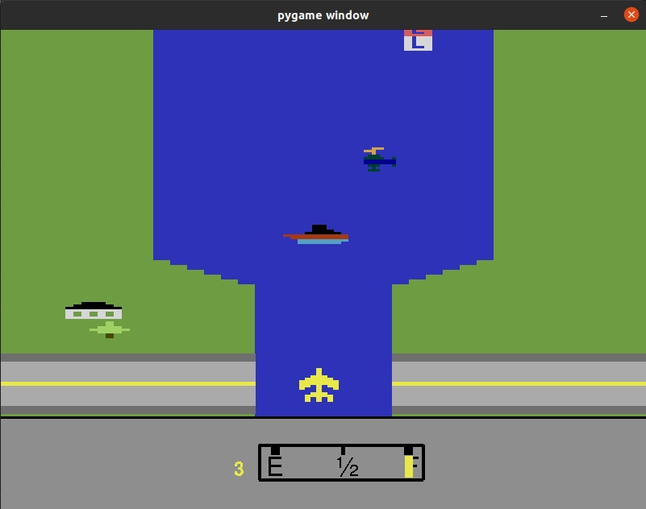
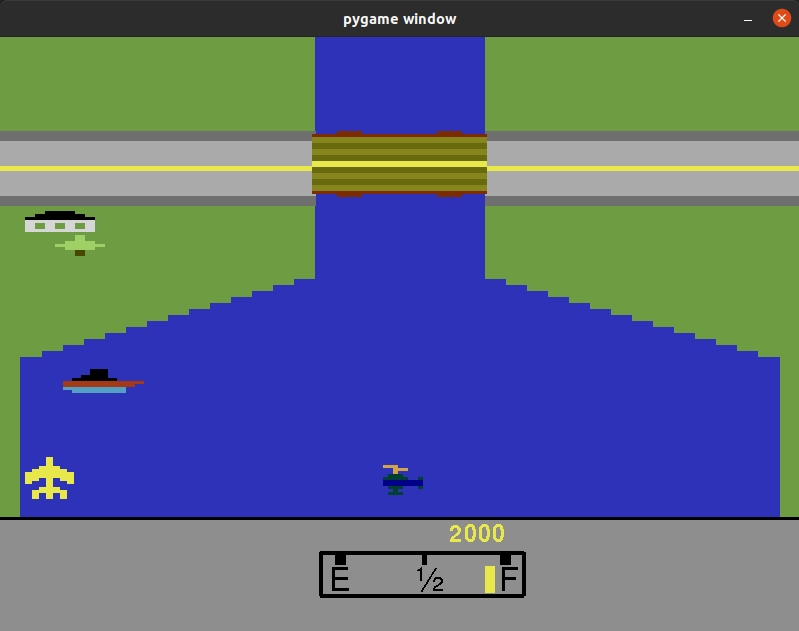
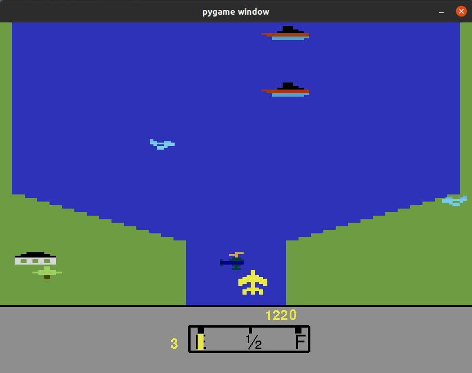

# RiverRaid
River Raid is a Vertical Shooter game from Atari 2600.

River Raid is a vertically scrolling shooter designed and programmed by Carol Shaw and published by Activision in 1982 for the Atari 2600 video game console. Over a million game cartridges were sold. Activision later ported the title to the Atari 5200, ColecoVision, and Intellivision consoles, as well as to the Commodore 64, IBM PCjr, MSX, ZX Spectrum, and Atari 8-bit family. Shaw did the Atari 8-bit and Atari 5200 ports herself.

It was implemented as homework/study for Phyton and PyGame, just for fun. 

<table width:100%>
  <tr>
    <td></td>
    <td></td>
    <td></td>
    <td></td>
  </tr>
</table>
